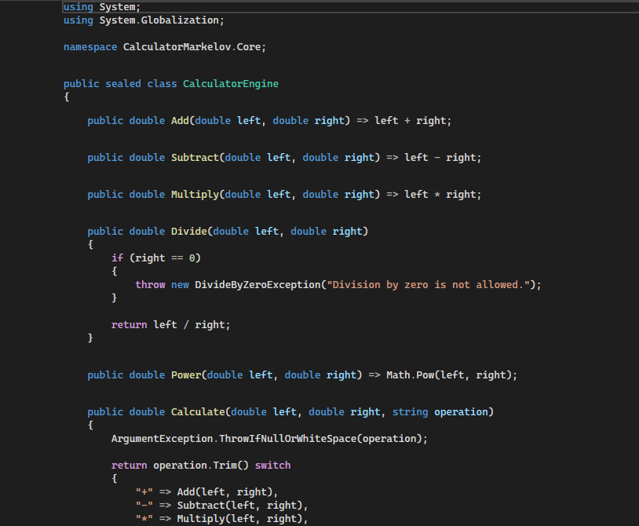
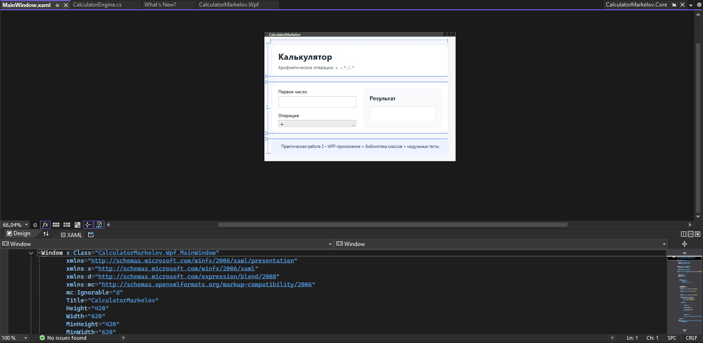

Министерство науки и высшего образования Российской Федерации

Российский экономический университет имени Г.В. Плеханова

Пермский институт (филиал)

      

<b>СОПРОВОДИТЕЛЬНАЯ ЗАПИСКА</b>

к практической работе №2

  

по теме:

<b>«Разработка WPF-приложения «Калькулятор» с модульным тестированием»</b>

    

Выполнил: 
студент 2 курса 
группы ИПО-21 
Маркелов Игорь Вячеславович  
Проверил: 
Берестов Дмитрий Борисович

       

Пермь, 2026

# Оглавление

- [Введение](#введение)
- [1. Цель работы](#1-цель-работы)
- [2. Постановка задачи](#2-постановка-задачи)
- [3. Используемые средства разработки](#3-используемые-средства-разработки)
- [4. Проектирование приложения](#4-проектирование-приложения)
  - [4.1. Общая структура решения](#41-общая-структура-решения)
  - [4.2. Архитектура программы](#42-архитектура-программы)
- [5. Создание библиотеки классов](#5-создание-библиотеки-классов)
  - [5.1. Назначение библиотеки](#51-назначение-библиотеки)
  - [5.2. Реализация основных методов](#52-реализация-основных-методов)
- [6. Создание интерфейса WPF](#6-создание-интерфейса-wpf)
  - [6.1. Создание проекта WPF](#61-создание-проекта-wpf)
  - [6.2. Разработка главного окна](#62-разработка-главного-окна)
- [7. Реализация логики взаимодействия интерфейса и библиотеки](#7-реализация-логики-взаимодействия-интерфейса-и-библиотеки)
- [8. Разработка модульных тестов](#8-разработка-модульных-тестов)
  - [8.1. Создание тестового проекта](#81-создание-тестового-проекта)
  - [8.2. Список реализованных тестов](#82-список-реализованных-тестов)
- [9. Тестирование программы](#9-тестирование-программы)
- [10. Результаты выполнения работы](#10-результаты-выполнения-работы)
- [Заключение](#заключение)
- [Список использованных источников](#список-использованных-источников)
- [Приложения](#приложения)

---

# Введение

В рамках данной практической работы была разработана настольная программа **«Калькулятор»** с использованием технологии **WPF** в среде **Microsoft Visual Studio 2022**.  
Согласно условию задания, графический интерфейс должен быть реализован в виде отдельного WPF-приложения, а вычислительная логика — вынесена в библиотеку классов. Дополнительно для библиотеки требуется создать модульные тесты.

Выполнение данной работы позволяет закрепить следующие практические навыки:

- создание решений в Microsoft Visual Studio 2022;
- разработка приложений на языке C#;
- создание пользовательского интерфейса в WPF;
- выделение бизнес-логики в отдельную библиотеку классов;
- написание и запуск модульных тестов;
- документирование этапов разработки программного обеспечения.

---

# 1. Цель работы

Целью практической работы является разработка приложения **«Калькулятор»** на языке **C#** с графическим интерфейсом **WPF**, выносом логики вычислений в отдельную библиотеку классов и созданием модульных тестов для проверки корректности работы программы.

---

# 2. Постановка задачи

В соответствии с заданием необходимо было:

1. Создать приложение **«Калькулятор»** в среде **Microsoft Visual Studio 2022**.
2. Реализовать выполнение арифметических операций:
   - сложение `+`;
   - вычитание `-`;
   - умножение `*`;
   - деление `/`;
   - возведение в степень `^`.
3. Реализовать основную вычислительную логику в виде библиотеки классов.
4. Реализовать пользовательский интерфейс в виде WPF-приложения.
5. Создать модульные тесты для классов библиотеки.
6. Подготовить сопроводительную записку с описанием этапов разработки и иллюстрациями.

---

# 3. Используемые средства разработки

При выполнении работы использовались следующие программные и технические средства:

- **Операционная система:** Windows 11
- **Среда разработки:** Microsoft Visual Studio 2022
- **Язык программирования:** C#
- **Платформа:** .NET 9
- **SDK:** .NET SDK 9.0
- **Технология построения интерфейса:** WPF
- **Система модульного тестирования:** MSTest
- **Средство управления версиями:** Git
- **Платформа размещения проекта:** GitHub

Для корректной работы проекта в Visual Studio 2022 должна быть установлена рабочая нагрузка **.NET desktop development**.

---

# 4. Проектирование приложения

## 4.1. Общая структура решения

Разработанное решение состоит из трёх проектов:

1. **CalculatorMarkelov.Core** — библиотека классов, содержащая вычислительную логику.
2. **CalculatorMarkelov.Wpf** — WPF-приложение с графическим интерфейсом.
3. **CalculatorMarkelov.Tests** — проект модульных тестов.

Такое разделение обеспечивает:

- удобство сопровождения и расширения программы;
- повторное использование логики;
- независимое тестирование вычислительного ядра;
- соблюдение принципа разделения ответственности.

## 4.2. Архитектура программы

Архитектура приложения построена следующим образом:

- пользователь вводит в интерфейсе полное арифметическое выражение;
- WPF-приложение передаёт строку выражения в библиотеку классов;
- библиотека разбирает выражение с учётом приоритета операций, скобок и унарного минуса;
- после вычисления библиотека возвращает результат;
- интерфейс отображает результат либо сообщение об ошибке;
- проект модульных тестов проверяет корректность работы арифметических методов и разборщика выражений независимо от интерфейса.

---

# 5. Создание библиотеки классов

## 5.1. Назначение библиотеки

Библиотека классов **CalculatorMarkelov.Core** предназначена для хранения основной логики приложения.  
В библиотеке реализованы методы выполнения арифметических операций и разбор арифметических выражений с несколькими операндами.

В библиотеке были созданы:

- класс `CalculatorEngine`;
- вспомогательный класс `NumberParser`;
- внутренний разборщик выражений `ExpressionParser`;
- пользовательские исключения `UnsupportedOperationException` и `InvalidExpressionException`.

Основные методы класса `CalculatorEngine`:

- `Add()` — сложение;
- `Subtract()` — вычитание;
- `Multiply()` — умножение;
- `Divide()` — деление;
- `Power()` — возведение в степень;
- `Calculate(double left, double right, string operation)` — вычисление одной операции над двумя операндами;
- `EvaluateExpression()` / `Calculate(string expression)` — вычисление полного арифметического выражения;
- `TryEvaluateExpression()` / `TryCalculate(string expression, ...)` — безопасный вариант вычисления с возвратом сообщения об ошибке.

## 5.2. Реализация основных методов

На этапе разработки библиотеки были выполнены следующие действия:

1. В Visual Studio 2022 создан проект типа **Class Library**.
2. Проекту присвоено имя **CalculatorMarkelov.Core**.
3. Создан основной класс `CalculatorEngine`.
4. В классе реализованы методы арифметических операций.

Краткое описание реализованных методов:

- метод `Add()` возвращает сумму двух чисел;
- метод `Subtract()` возвращает разность;
- метод `Multiply()` возвращает произведение;
- метод `Divide()` выполняет деление и проверяет делитель на ноль;
- метод `Power()` использует математическую функцию `Math.Pow()` для возведения числа в степень;
- метод `EvaluateExpression()` запускает разбор и вычисление выражения целиком;
- разборщик `ExpressionParser` поддерживает несколько операндов, скобки, унарный плюс и минус, а также приоритет операций;
- метод `TryEvaluateExpression()` позволяет безопасно обработать ошибки, не завершая работу приложения аварийно;
- перегрузка `Calculate(double left, double right, string operation)` сохранена для базовых операций и модульных тестов.

Класс `NumberParser` реализует преобразование строкового значения в число и поддерживает как точку, так и запятую в качестве разделителя дробной части, а `InvalidExpressionException` используется для сообщений о синтаксических ошибках во входном выражении.

---

# 6. Создание интерфейса WPF

## 6.1. Создание проекта WPF

На следующем этапе был создан проект типа **WPF Application**.

Последовательность действий:

1. В существующее решение был добавлен новый проект.
2. Выбран шаблон **WPF Application**.
3. Проекту присвоено имя **CalculatorMarkelov.Wpf**.
4. Для WPF-проекта была добавлена ссылка на библиотеку классов **CalculatorMarkelov.Core**.

В результате был подготовлен отдельный проект, отвечающий только за графический интерфейс.

## 6.2. Разработка главного окна

Главное окно приложения содержит:

- поле для ввода арифметического выражения;
- блок с примерами корректного ввода;
- кнопку **«Вычислить выражение»**;
- кнопку **«Очистить»**;
- поле вывода результата;
- текстовый блок для вывода служебных сообщений.

При разработке интерфейса использовались элементы WPF:

- `TextBox`;
- `Button`;
- `TextBlock`;
- `Separator`;
- контейнеры разметки `Grid`, `StackPanel`, `Border`.

Интерфейс был оформлен так, чтобы обеспечить удобство работы пользователя и наглядное отображение результата вычислений.

---

# 7. Реализация логики взаимодействия интерфейса и библиотеки

Для связи WPF-интерфейса с библиотекой в коде главного окна создаётся экземпляр класса `CalculatorEngine`.

Основные этапы работы программы:

1. Пользователь вводит арифметическое выражение в текстовое поле.
2. Нажимает кнопку **«Вычислить выражение»**.
3. Программа считывает введённую строку.
4. Выражение передаётся в библиотеку классов.
5. Разборщик выражений определяет порядок выполнения операций.
6. Библиотека выполняет вычисление и возвращает результат.
7. Полученный результат отображается в правой части окна.
8. Если выражение содержит ошибку, выводится понятное сообщение для пользователя.

Также была реализована кнопка **«Очистить»**, которая сбрасывает поле выражения, очищает результат и возвращает приложение в исходное состояние.

Для удобства пользователя были добавлены служебные сообщения:

- об успешном вычислении выражения;
- о некорректном формате числа;
- об ошибке в записи выражения;
- о делении на ноль;
- об очистке поля ввода.

---

# 8. Разработка модульных тестов

## 8.1. Создание тестового проекта

Для проверки корректности логики вычислений был создан отдельный проект модульных тестов.

Последовательность действий:

1. В решение был добавлен новый тестовый проект.
2. Выбран шаблон проекта тестов.
3. Проекту присвоено имя **CalculatorMarkelov.Tests**.
4. В тестовый проект добавлена ссылка на библиотеку **CalculatorMarkelov.Core**.
5. Создан класс тестов `CalculatorEngineTests`.

В качестве средства тестирования использовался фреймворк **MSTest**.

## 8.2. Список реализованных тестов

В тестовом проекте реализованы проверки для следующих случаев:

- корректность сложения;
- корректность вычитания;
- корректность умножения;
- корректность деления;
- деление на ноль;
- корректность возведения в степень;
- корректность вычисления полных выражений;
- соблюдение приоритета операций;
- корректная обработка скобок;
- корректная обработка унарного минуса;
- корректность обработки строковых чисел;
- корректность работы парсинга чисел;
- обработка пустого и некорректного ввода;
- работа методов `TryCalculate()` и `TryEvaluateExpression()`.

Примеры проверок:

- `2 + 3 = 5`;
- `2 + 3 * 4 = 14`;
- `(2 + 3) * 4 = 20`;
- `-2 ^ 2 + 6 = 2`;
- `2 ^ (-2) = 0.25`;
- при делении на ноль внутри выражения должно возвращаться контролируемое сообщение об ошибке;
- при вводе строки `10,5` число должно корректно интерпретироваться как `10.5`.

---

# 9. Тестирование программы

После завершения разработки были выполнены следующие действия:

1. Проведена сборка всего решения.
2. Выполнен запуск WPF-приложения.
3. Проверена работа выражений с несколькими операндами.
4. Проверена корректность приоритета операций и обработки скобок.
5. Проверена корректность отображения результата.
6. Проверена обработка ошибочных ситуаций:
   - пустой ввод;
   - некорректный формат числа;
   - синтаксическая ошибка в выражении;
   - деление на ноль.
7. Выполнен запуск модульных тестов через **Test Explorer**.

В ходе тестирования было установлено, что:

- арифметические выражения вычисляются корректно;
- поддерживаются несколько операндов, скобки и унарный минус;
- дробные числа с точкой и запятой обрабатываются корректно;
- ошибки ввода и синтаксические ошибки обрабатываются без аварийного завершения программы;
- модульные тесты подтверждают корректность вычислительной логики и алгоритма разбора выражений.

---

# 10. Результаты выполнения работы

В результате выполнения практической работы было разработано приложение **«Калькулятор»**, соответствующее условиям задания.

Были достигнуты следующие результаты:

- создано решение в Microsoft Visual Studio 2022;
- разработана библиотека классов с вычислительной логикой;
- создано WPF-приложение с графическим интерфейсом;
- реализовано вычисление выражений с несколькими операндами, операциями `+`, `-`, `*`, `/`, `^`, скобками и унарным минусом;
- реализована обработка ошибок пользовательского ввода и синтаксических ошибок выражения;
- создан отдельный проект модульных тестов;
- подготовлены материалы для публикации на GitHub.

---

# Заключение

В ходе выполнения практической работы были получены практические навыки разработки настольных приложений на языке **C#** с использованием технологии **WPF**.  
Была реализована архитектура, при которой вычислительная логика вынесена в отдельную библиотеку классов, а пользовательский интерфейс представлен как самостоятельное графическое приложение.

Дополнительно были разработаны модульные тесты, позволяющие проверить корректность основных вычислительных методов. Это повысило надёжность программы и упростило проверку результатов.

Поставленная цель была достигнута, основные требования задания выполнены в полном объёме.

---

# Список использованных источников

1. Metanit. C# и .NET. — URL: https://metanit.com/sharp/tutorial/
2. Metanit. WPF. — URL: https://metanit.com/sharp/wpf/
3. Microsoft Learn. Создание и запуск модульных тестов в Visual Studio 2022. — URL: https://learn.microsoft.com/ru-ru/visualstudio/test/walkthrough-creating-and-running-unit-tests-for-managed-code?view=vs-2022
4. Codernet. Модульное тестирование: что это, типы, инструменты. — URL: https://codernet.ru/articles/drugoe/modulnoe_testirovanie_yunit-testirovanie_chto_eto_tipyi_instrumentyi/

---

# Приложения

## Приложение А. Скриншот структуры решения

## Приложение Б. Скриншот библиотеки классов

## Приложение В. Скриншот интерфейса WPF-приложения

## Приложение Г. Скриншот модульных тестов

## Приложение Д. Ссылка на GitHub-репозиторий

*(ссылка будет добавлена после публикации репозитория)*

---

# Примечания по заполнению

Перед сохранением итогового документа в PDF необходимо:

1. заменить поля вида `[ ... ]` на реальные данные;
2. вставить скриншоты основных этапов разработки;
3. проверить корректность оглавления;
4. привести оформление к единому стилю;
5. сохранить документ в формате **PDF**.

---